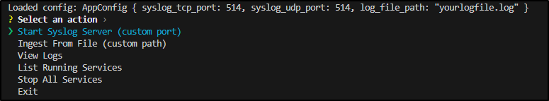

# SALTBUILD - Custom SIEM

A custom built SIEM written in Rust. To serve as apart of the SALTBUILD suite of IT/Security software & tools.
## Table of Contents

- [Installation](#installation)
- [Usage](#usage)
- [Contributing](#contributing)
- [License](#license)

## Installation

Instructions on how to install and set up the project.

```bash
# Example command
git clone https://github.com/yourusername/yourproject.git
cd yourproject
```

## Usage

Examples of how to use the project.

```bash
# Example usage
cargo build
cargo run
```

You'll be greeted with a CLI


## Contributing

Contributions are welcome! Please see the [CONTRIBUTING.md](CONTRIBUTING.md) for guidelines.

## License

This project is licensed under the [MIT License](LICENSE).